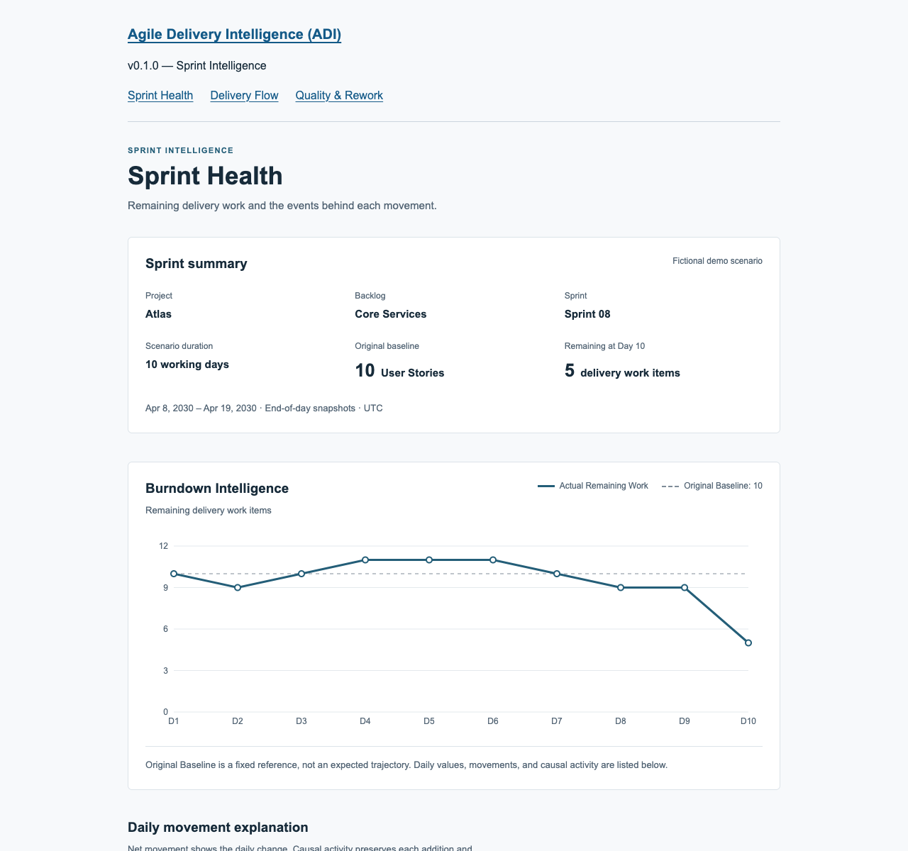
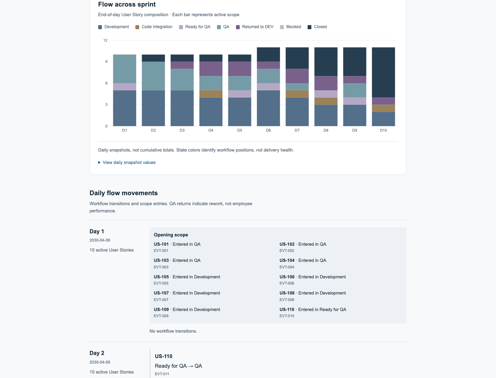
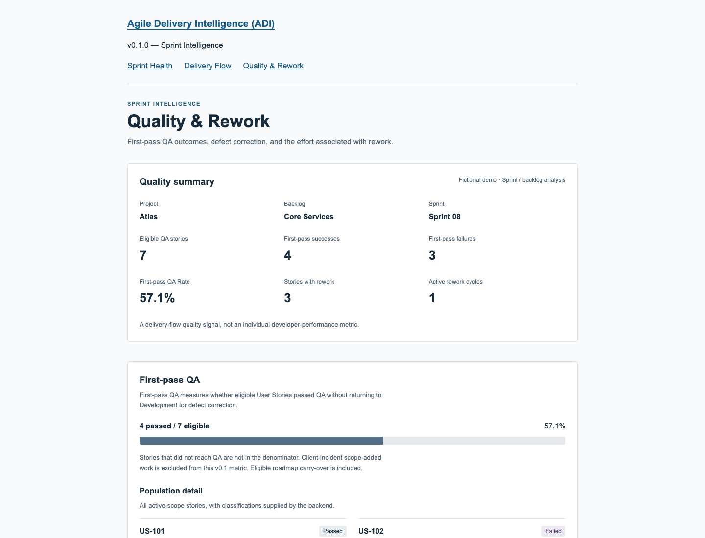

# Agile Delivery Intelligence (ADI)

**From work tracking to delivery understanding.**

ADI is a delivery-intelligence layer that turns Agile execution data into delivery movement, causal context, workflow visibility, QA/rework insights, and management-ready information.

Azure DevOps, Jira, ClickUp, and Linear are strong work-tracking systems. ADI explores a complementary intelligence layer; it does not replace them. The current demo uses fictional JSON data, with no external integrations.

**Status: Active portfolio project** · **v0.1.0 — Sprint Intelligence: Feature complete — pending portfolio release preparation.**

Three implemented views connect remaining work, workflow position, and QA/rework evidence. **All displayed project and sprint data are fictional demo data.**

[Explore the views](#v010--sprint-intelligence) · [Architecture](#architecture) · [Run locally](#local-setup) · [Validation](#automated-validation)

## The problem

Delivery tools expose tasks, statuses, burndown, Bugs, and workflow data. Delivery leaders still often interpret manually why a sprint moved, why remaining work increased, where work accumulated, how QA rework affected delivery, and which records explain a deviation.

ADI v0.1.0 demonstrates an approach to connecting those signals through traceable events rather than isolated totals.

## v0.1.0 — Sprint Intelligence

Each slice is implemented end to end: dataset → domain engine → read-only API → UI.

### Burndown Intelligence

Shows remaining delivery work against an immutable baseline, upward movements, flatlines, and the causal events behind each day. A flat day can still contain both added scope and completed work; both causes remain visible. The baseline is a reference, not an ideal trajectory.



*All displayed project and sprint data are fictional demo data.*

[Burndown semantics and evidence](docs/burndown-intelligence.md)

### Delivery Flow Intelligence

Shows where User Stories are located, their daily workflow composition, QA → DEV returns, and movements across the sprint. Daily snapshots and story-level events make intermediate workflow changes inspectable.



*All displayed project and sprint data are fictional demo data.*

[Delivery Flow reconstruction](docs/delivery-flow-intelligence.md)

### Quality & Rework Intelligence

Shows First-pass QA, the eligible population, stories requiring rework, cycle status, linked Bugs, and recorded rework effort. Outcomes remain separate from final delivery state: a story can fail its first QA attempt and still reach Closed during the sprint.



*All displayed project and sprint data are fictional demo data.*

[Quality & Rework definitions](docs/quality-rework-intelligence.md)

## Demo data

Project **Atlas**, backlog **Core Services**, and **Sprint 08** are fictional. The frozen scenario reflects common software-delivery patterns: successful QA paths, QA returns, Bugs that block story closure, carry-over, scope added after baseline, and unfinished stories.

The fixture is designed to test delivery-intelligence behavior, **not employee performance**. It contains no real employer, client, or employee records. Its ten-day event history and task effort are documented in the [Sprint 08 audit](data/demo/sprint-08/AUDIT.md).

## Architecture

```text
Fictional Demo JSON
        ↓
Domain Intelligence Engines
        ↓
FastAPI
        ↓
Typed Next.js API Clients
        ↓
Sprint Intelligence UI
```

The **Burndown Intelligence Engine**, **Delivery Flow Intelligence Engine**, and **Quality & Rework Intelligence Engine** perform business calculations in Python. Fixture-loading services connect these pure domain functions to read-only FastAPI routes. Typed Next.js server clients fetch the results; the frontend formats and presents them without recalculating business metrics.

There is no database, authentication, external integration, or AI recommendation service in v0.1.0.

## Engineering and product principles

- **Data over perception:** deterministic engines reconstruct workflow from delivery events.
- **Immutable baseline:** scope additions remain separate from the original sprint commitment.
- **Context explains metrics:** causal activity is preserved separately from net movement.
- **Team-level analysis:** QA and rework describe delivery, not individual rankings.
- **Auditability:** frozen fixture checks and event/record IDs support traceability; v0.1 has no manual override of calculated intelligence.

QA performs certification/validation. A return from QA to DEV represents required rework before final closure; a User Story is fully completed only at `Closed`. These are the demo's documented workflow conventions, not a claim about acceptance ownership in every organization.

[Product principles](docs/product-principles.md) · [Technical decisions](docs/technical-decisions.md)

## Technology stack

| Layer | Implemented technologies |
| --- | --- |
| Frontend | Next.js App Router, React, TypeScript, Recharts, plain CSS |
| Backend | Python, FastAPI, Uvicorn |
| Testing and tooling | pytest, Python unittest, Vitest, React Testing Library, jsdom, ESLint, TypeScript checks |
| Data | Frozen fictional JSON fixture, dataset version v1 |

## Automated validation

Latest verified suite: **91 backend tests**, **21 dataset tests**, and **69 frontend tests**; **lint, TypeScript checks, and production build passing**.

Coverage includes event reconstruction, immutable baseline and fixture checks, synthetic domain cases, API/domain parity, and frontend presentation and loading/error/empty states. These are validation evidence, not a quality score.

From the repository root:

```sh
npm test
npm run lint
npm run typecheck
npm run build
python3 -m unittest discover -s data/tests -v
```

From `apps/api`, with its virtual environment active:

```sh
python -m pytest -W error
```

## Manual deployment

Follow [Vercel deployment instructions](docs/deployment-vercel.md) for fresh backend and frontend imports. Configuration is prepared; successful live deployment is not yet claimed.

## Local setup

### Prerequisites

- Node.js **24.x** with npm, matching the configured `engines` requirement and lockfile.
- Python **3.14** with pip and venv, selected by root `.python-version`; locally verified with Python 3.14.6.

### Frontend

From the repository root:

```sh
npm ci
npm run dev
```

Open `http://localhost:3000`. Use the existing navigation for Sprint Health, Delivery Flow, and Quality & Rework. Start the backend in a second terminal to load the demo results.

### Backend

From the repository root:

```sh
cd apps/api
python3 -m venv .venv
source .venv/bin/activate
python -m pip install -r requirements-dev.txt
python -m uvicorn app.main:app --reload --host 127.0.0.1 --port 8000
```

On Windows PowerShell, replace the activation command with `.venv\Scripts\Activate.ps1`.

The API provides `GET /health` and these read-only routes:

```text
GET /demo/sprint-08/burndown
GET /demo/sprint-08/delivery-flow
GET /demo/sprint-08/quality-rework
```

### API configuration

The Next.js server defaults to `http://127.0.0.1:8000`. To use a different API address, run from the repository root:

```sh
cp apps/web/.env.example apps/web/.env.local
```

Set `ADI_API_BASE_URL` in that file and restart the frontend. This variable is server-only. No database, external credentials, or Docker setup is needed.

## Repository structure

```text
apps/
  web/   # Next.js pages, typed API clients, presentation tests
  api/   # Python domain engines, fixture services, FastAPI, tests
data/    # Frozen fictional scenario, schema, dataset validation
docs/    # Product principles, intelligence semantics, decisions, screenshots
```

## Documentation

- [Product Principles](docs/product-principles.md)
- [Burndown Intelligence](docs/burndown-intelligence.md)
- [Delivery Flow Intelligence](docs/delivery-flow-intelligence.md)
- [Quality & Rework Intelligence](docs/quality-rework-intelligence.md)
- [Technical Decisions](docs/technical-decisions.md)
- [Sprint 08 Audit](data/demo/sprint-08/AUDIT.md)
- [Milestones](docs/milestones.md)

## Roadmap

**Current:** v0.1.0 — Sprint Intelligence is feature complete and undergoing public release preparation. This is an active portfolio project, not a claim of enterprise production readiness.

**Future planned exploration — not implemented:** Capacity Health, Impediment Intelligence, Portfolio Intelligence, Carry-over Intelligence, Release Readiness, and external work-tracking integrations. No delivery timelines are committed.

## License

No open-source license has been granted for this repository.
